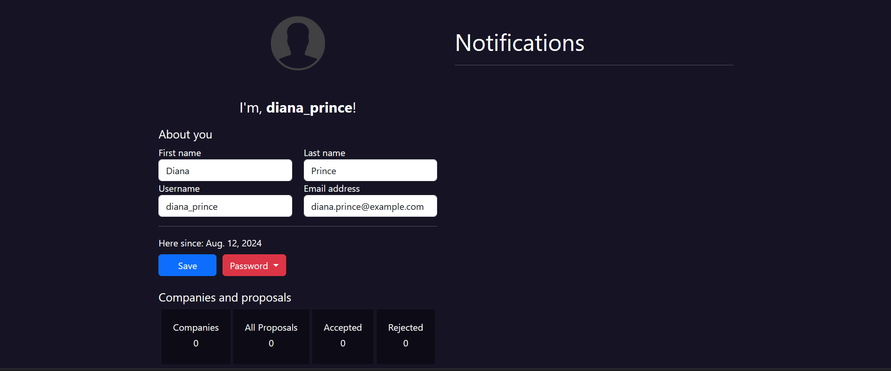

<div align="center">
    
</div>
<div align="center">


</div>
<hr>
<p align="center">For all investors, this application will be useful. This application is a platform for companies to sell their shares and thus allow investors to buy a percentage of those shares.</p>

### Preview 📷
#### 🔴 Authentication





#### 🔴 Companies


#### 🔴 Investors


### Features ⚡

- User
    - Signup
    - Login
    - Logout
    - Reset password
    - Change password
    - Profile management
    - Notifications

- Companies
    - New companies
    - Search for companies
    - Companies management
        - Get investment requests 
        - See investors 
        - See like investors
        - Attach a document
        - Fix some metrics

- Investors
    - Make investment proposals
    - Sugest companies


### Contributing 🫂
For contribut, fork this project, make your alterations then send me a pull requests wth a good message 🌟

### How to run?
```bash 
    # clone the project
    $ git clone https://github.com/angelo-francisco/InvestUp.git

    # Create a venv
    $ python3 -m venv venv

    # Acess it(it's diferent at the MacOS and Linux dists)
    $ ./venv/Scripts/Activate

    # Download the dependencies
    $ pip install django Pillow

    # Run and make your editions
    $ python manage.py runserver

```
